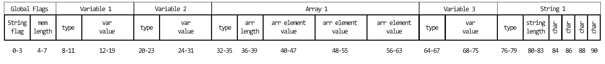

# Compiling a higher-level language to WebAssembly

A project of the software composition seminar at UniBE

### Prerequisites

Before you can use this project, make sure that you have a wat2wasm binary installed. A binary-toolkit including wat2wasm can be downloaded here https://github.com/WebAssembly/wabt.

The rest of the project just runs in your browser.

### Syntax and pipeline

To use this project, simply open the 'index.html' file in your browser. Then write your code in the text area and click submit, e.g.

```
def main {(1+2)*3+4;};
```

This will open a download prompt for a 'index.wat' file. After this step you need to translate the text format to a binary format with 'wat2wasm'. Open your terminal and type:

```
wat2wasm index.wat -o index.wasm
```

After that, you can press the Button 'Display result' and the result should be displayed.

For the syntax see [Syntax](resources/syntax.md)

#### AST


#### Memory

Here is a draft for an example of the new memory usage.



First four bytes are reserved for the string flag and the memory length. Then variables have a fixed length of 12 bytes: 4 bytes for the type and 8 bytes for the value. Arrays have a length of at least 16 bytes: 4 bytes for the type, 4 bytes for the length and at least one value with 8 bytes.
Strings are like arrays, only the values in there are utf-16 code for the Characters. Minimum Size for a string is 12 bytes: 4 bytes for the type, 4 bytes for the length, 2 bytes for a character, and 2 bytes for the null character.
In the compiler memory, arrays and strings (variables will follow) are now written as quadrupels {name, type, start offset, length}.

## Project Idea

WebAssembly is a relatively new assembly language that aims at providing near-native performance for the web. The standard is independent of an in-browser runtime, there exists a runtime on NodeJS and a C-to-WebAssembly compiler as well. The goal of this project is to explore and build a compiler pipeline for a higher-level language (COOL, MiniJava, ...), targeting WebAssembly. You will explore parser generators, IRs, and the WebAssembly specification.

### Notices

Addition and subtraction was implemented with integers. Division had to be implemented with floats, so every operation is evaluated with float64. Module description of .wat file had to be done in the write/export function.

Separating the parser in mathematical function which are evaluated and other stuff like setting variables is trickier than anticipated (with a lack of compiler knowledge).

As parameters don't have a fixed number it could be tricky. But as expressions in pegjs are returned as arrays, it can be achieved quite easily.

Everything is done with f64 as of now, but compare operators (like *less than*) return an integer. Booleans are only allowed inside *if*s and *while*s.

Adding secondary step (AST before outputting as .wat) took longer than expected. Didn't really know what I was doing in the beginning, but seems to work now.

Arrays are added through storage in main memory. Kind of a hack, as they are global arrays (would be better to scope them, but I don't see how I could achieve that in WebAssembly, as arrays are not natively supported).

Strings are even more of a hack. They are also stored in the main memory as *data*. They have a minimal offset of 1024 and a maximum length of 256. This means, that arrays can only have 128 elements altogether. We could augment the minimal offset of strings to allow more arrays.

### Resources

https://pegjs.org/online

https://developer.mozilla.org/en-US/docs/WebAssembly/Understanding_the_text_format

http://webassembly.github.io/spec/core/index.html

https://github.com/sunfishcode/wasm-reference-manual/blob/master/WebAssembly.md

https://cdn.rawgit.com/WebAssembly/wabt/fb986fbd/demo/wat2wasm/

https://mbebenita.github.io/WasmExplorer/

http://ast.run/

https://medium.com/@mbebenita/hello-world-in-webassembly-83951757775
